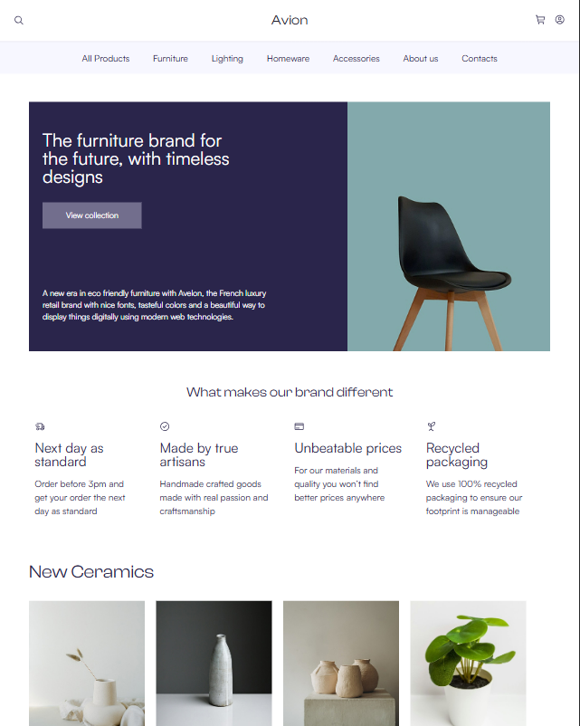
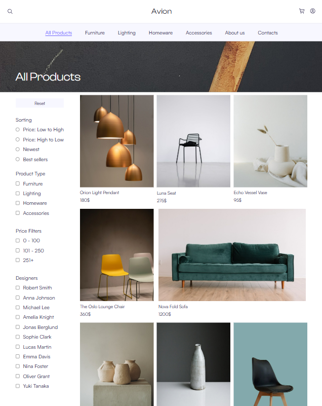
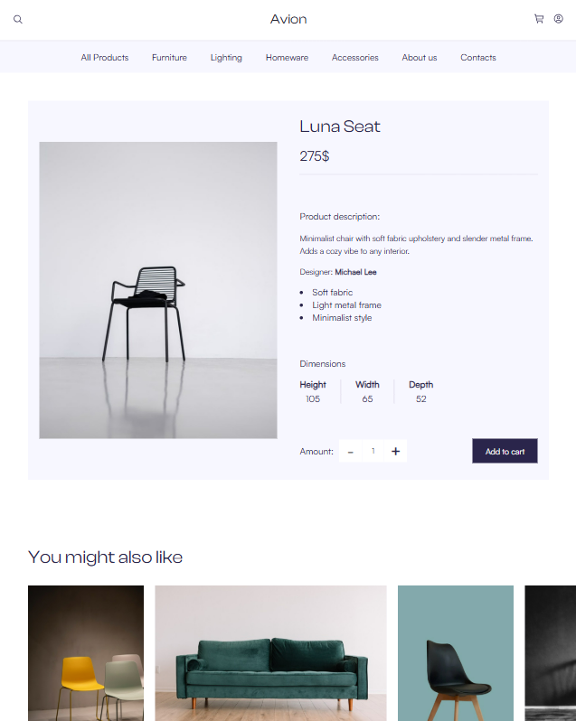
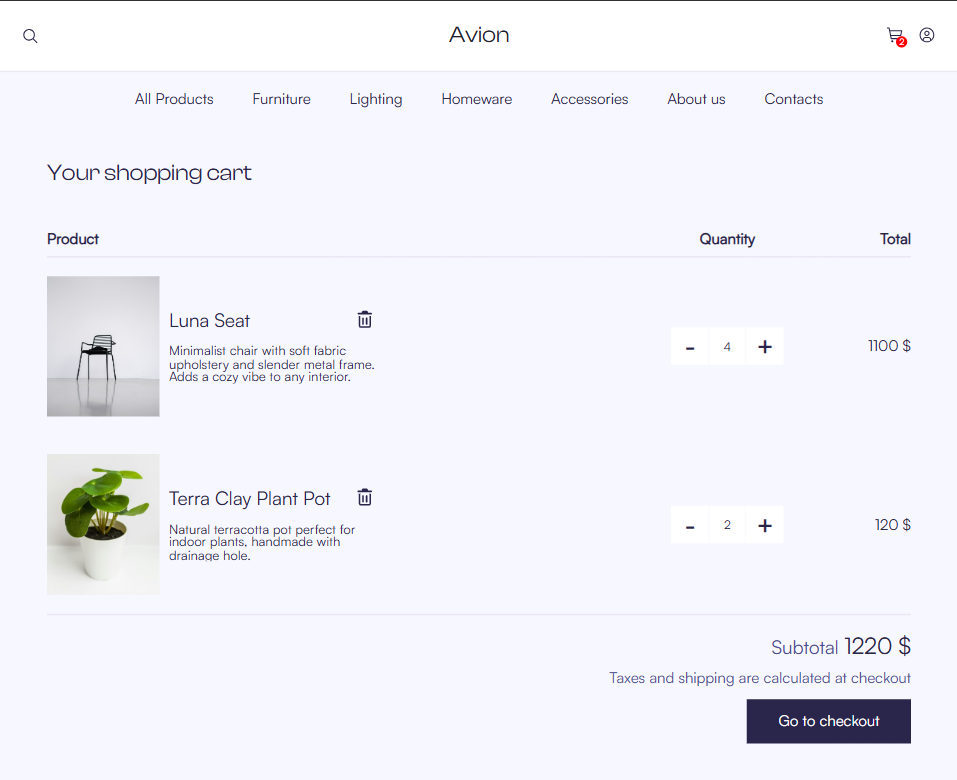
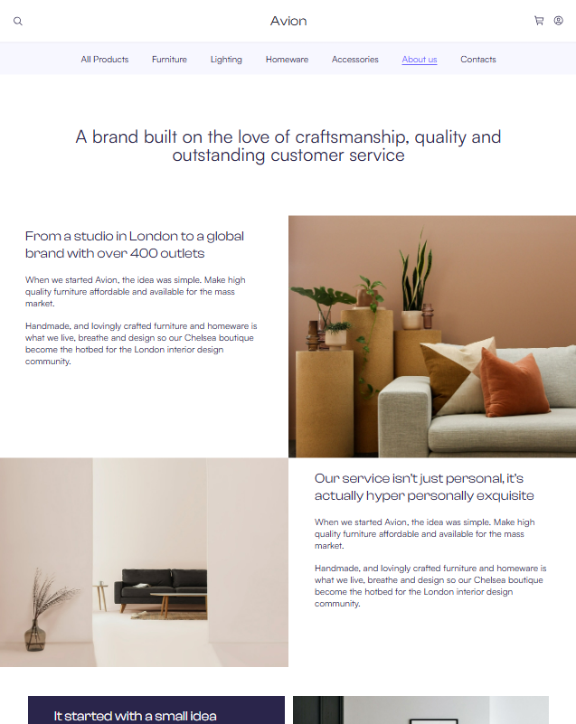
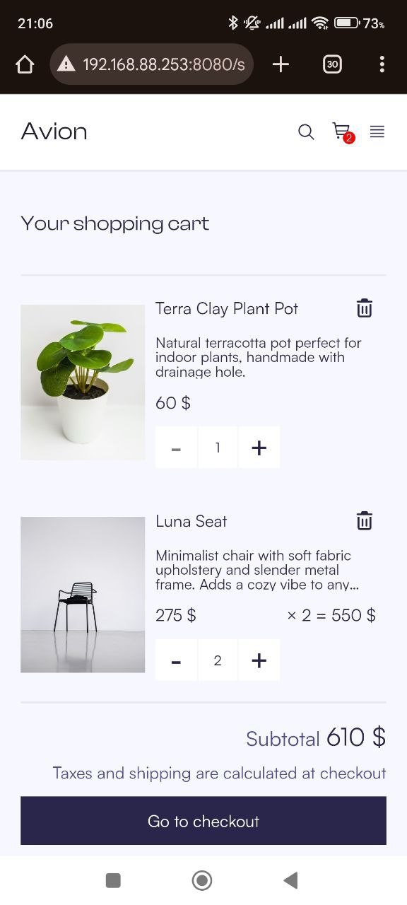
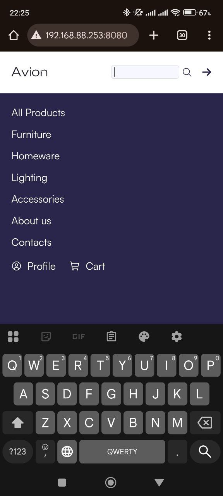

# 🛍 Avion — Online Store (React + TypeScript + Node.js)

Повноцінний інтернет-магазин з інтегрованим бекендом, створений на **React, TypeScript, Node.js (Express) та MongoDB**.
Проєкт має сучасний мінімалістичний інтерфейс, оптимізований під зручний процес покупок, та працює з реальними даними з бази.


---

## 🚀 Live Demo
[Відкрити демо на GitHub Pages](https://nikita-7onenko-dev.github.io/Avion-Online-Store/)

---

## ✨ Можливості
- **Каталог товарів з фільтрацією та сортуванням**
    - Динамічне завантаження товарів з бекенду (Node + Express + MongoDB)
    - Підтримка серверної пагінації (швидке завантаження навіть при великій кількості товарів)
    - Фільтрування за типом товару, ціною або дизайнером
    - Сортування за ціною, популярністю та новинками
- **Рекомендації за категорією**
    - Пропонує схожі товари під час перегляду певного товару
- **Кошик**
    - Додавання/видалення товарів у глобальному стані
    - Автоматичний розрахунок загальної ціни
- **Адаптивний дизайн**
    - Повністю адаптований для мобільних пристроїв та комп'ютерів
- **Навігація**
    - React Router v6 (динамічні маршрути для сторінок товарів та категорій)
    - Бургер меню для мобільних пристроїв
    - Список товарів, сторінки категорій, сторінка «Про нас» та сторінка зворотнього зв’язку
- **Бекенд**
    - [Переглянути](https://github.com/Nikita-7onenko-dev/Avion-Online-Store-Server.git)  
    - REST API з CRUD-операціями для товарів
    - Система фільтрації та сортування напряму в базі (Mongo queries)
    - Архітектура з розділенням на контролери, сервіси та моделі
    - Підготовлений модуль авторизації та реєстрації (JWT-токени, bcrypt-хешування паролів)

---

## 🚧 У розробці
- Сторінка користувача (профіль, дані облікового запису, історія замовлень)
- Реєстрація та логін на фронтенді з інтеграцією в бекенд
- Адмін-панель для керування товарами (CRUD через UI)

> Проєкт оновлюється регулярно — додаються нові фічі та оптимізації.

---

## 🛠 Tech stack

### Frontend
- **React 18**  
- **TypeScript**  
- **SCSS Modules** (BEM‑friendly structure)  
- **React Router v6**  
- **Webpack**
  
### Backend
* Node.js
* Express
* MongoDB (Mongoose)
* JWT Auth

---

## 📦 Встановлення
```bash
git clone https://github.com/Nikita-7onenko-dev/Avion-Online-Store.git
```
```bash
cd avion
```
```bash
npm install
```
```bash
npm run dev
```

---

## 📸 Screenshots 
### Головна сторінка


### Список товарів


### Сторінка товару


### Кошик


### Сторінка «Про нас»


### Вигляд з мобільного пристрою


### Кошик


### Бургер


## 📌 Статус проекту
В активній розробці — мінімальний функціонал реалізовано, незабаром з’являться нові фітчі.
